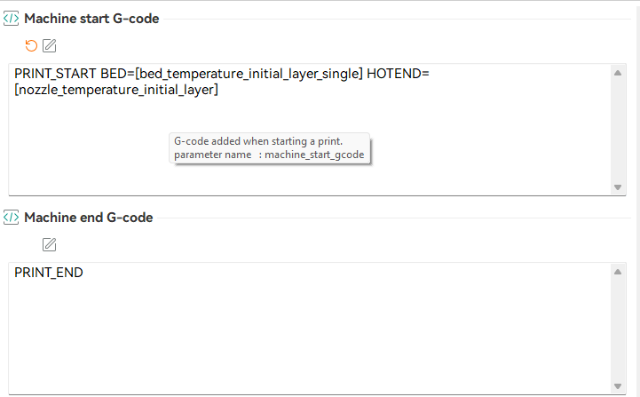

# Image Catalog

This document catalogs all screenshots and images in the printer configuration repository, including their purpose, context, and problem resolution.

---

## Image Index

| Filename | Date | Related Log | Issue | Status |
|----------|------|-------------|-------|--------|
| `start_end_gcode.png` | 2025-11-26 | 15-gcode-path-fix.md | PRINT_START macro parameters | [DONE] RESOLVED |
| `slicer_test_print.png` | 2025-11-26 | 16-orcaslicer-bed-size-fix.md | Bed size mismatch | [DONE] RESOLVED |
| `printer_gcode_viewer_tracking.png` | 2025-11-26 | 16-orcaslicer-bed-size-fix.md | Bed size mismatch | [DONE] RESOLVED |
| `cube_x.jpg` | 2025-11-26 | 17-first-test-print-analysis.md | X face quality analysis | [DONE] REFERENCE |
| `cube_y.jpg` | 2025-11-26 | 17-first-test-print-analysis.md | Y face quality analysis | [DONE] REFERENCE |
| `cube_z.jpg` | 2025-11-26 | 17-first-test-print-analysis.md | Z face (top) quality analysis | [DONE] REFERENCE |
| `cube_bottom.jpg` | 2025-11-26 | 17-first-test-print-analysis.md | Bottom face / first layer analysis | [DONE] REFERENCE |
| `cube_orca_logo.jpg` | 2025-11-26 | 17-first-test-print-analysis.md | Orca logo detail analysis | [DONE] REFERENCE |
| `cube_orcaslicer_text.jpg` | 2025-11-26 | 17-first-test-print-analysis.md | Text detail analysis | [DONE] REFERENCE |
| `cube_plus_screw.jpg` | 2025-11-26 | 17-first-test-print-analysis.md | Assembled cube + screw | [DONE] REFERENCE |
| `screw_bottom.jpg` | 2025-11-26 | 17-first-test-print-analysis.md | Screw head (plier damage) | [DONE] REFERENCE |
| `screw_top.jpg` | 2025-11-26 | 17-first-test-print-analysis.md | Screw head top surface | [DONE] REFERENCE |
| `screw_side.jpg` | 2025-11-26 | 17-first-test-print-analysis.md | Screw thread profile | [DONE] REFERENCE |

---

## Image Details

### 1. start_end_gcode.png

**Date Taken:** 2025-11-26  
**Source:** OrcaSlicer - Machine G-code settings  
**Related Log:** [15-gcode-path-fix.md](../logs/15-gcode-path-fix.md)

**Description:**
Screenshot of OrcaSlicer's Machine G-code configuration panel showing the corrected start and end G-code settings.

**What It Shows:**
- **Machine start G-code:** `PRINT_START BED=[bed_temperature_initial_layer_single] HOTEND=[nozzle_temperature_initial_layer]`
- **Machine end G-code:** `PRINT_END`
- OrcaSlicer printer settings interface

**Problem Context:**
Initial file upload from OrcaSlicer failed with error:
```
Error evaluating 'gcode_macro PRINT_START:gcode': 
jinja2.exceptions.UndefinedError: 'dict object' has no attribute 'HOTEND'
```

**Root Cause:**
- OrcaSlicer start G-code was using standard G-code commands (M104, M140, G28, etc.)
- The `PRINT_START` macro in `misc-macros.cfg` expected `BED` and `HOTEND` parameters
- Parameters were not being passed, causing Jinja2 template error

**Resolution:**
- Changed OrcaSlicer start G-code to call `PRINT_START` macro with proper parameters
- Changed OrcaSlicer end G-code to call `PRINT_END` macro
- Macros now handle all heating, homing, bed mesh loading, and purge operations

**Status:** [DONE] RESOLVED - Macro parameters correctly configured

**Technical Details:**
- **Issue Type:** Configuration mismatch between slicer and Klipper macros
- **Fix Type:** Update slicer G-code to use Klipper macros
- **Files Modified:** OrcaSlicer printer profile (Windows PC)

---

### 2. slicer_test_print.png

**Date Taken:** 2025-11-26  
**Source:** OrcaSlicer - Slicer preview window  
**Related Log:** [16-orcaslicer-bed-size-fix.md](../logs/16-orcaslicer-bed-size-fix.md)

**Description:**
Screenshot of OrcaSlicer's build plate preview showing two test objects (square and circle) positioned on the virtual build plate.

**What It Shows:**
- OrcaSlicer build plate view with grid overlay
- Two objects: rectangular block and cylindrical shape
- Objects appear centered on the build plate
- Build plate grid showing bed dimensions
- OrcaSlicer branding visible at bottom

**Problem Context:**
Objects appeared centered in OrcaSlicer but showed off-center when G-code was loaded in Mainsail's G-code viewer.

**Root Cause:**
- OrcaSlicer bed size configured as **250mm x 250mm** (incorrect)
- Actual Sovol SV06 bed size: **220mm x 220mm**
- Objects sliced with coordinates assuming larger bed
- When viewed in Mainsail (which knows actual bed size), objects appeared shifted

**Resolution:**
- Changed OrcaSlicer bed size from 250mm to 220mm
- Objects now position correctly relative to actual bed dimensions
- Slicer preview matches Mainsail G-code viewer preview

**Status:** [DONE] RESOLVED - Bed size corrected to 220mm x 220mm

**Technical Details:**
- **Issue Type:** Bed dimension misconfiguration
- **Fix Type:** Update OrcaSlicer printer profile bed size
- **Before:** 250mm x 250mm
- **After:** 220mm x 220mm
- **Files Modified:** OrcaSlicer printer profile (Windows PC)

**Coordinate Impact:**
- Objects centered on 250mm bed: X=125, Y=125
- Should be centered on 220mm bed: X=110, Y=110
- Offset: 15mm in each direction

---

### 3. printer_gcode_viewer_tracking.png

**Date Taken:** 2025-11-26  
**Source:** Mainsail - G-code viewer/preview window  
**Related Log:** [16-orcaslicer-bed-size-fix.md](../logs/16-orcaslicer-bed-size-fix.md)

**Description:**
Screenshot of Mainsail's G-code viewer showing the toolpath preview of the same test objects from OrcaSlicer, but displayed with Klipper's coordinate system.

**What It Shows:**
- Mainsail G-code preview window with dark background
- Grid overlay showing bed dimensions
- Two objects (orange/red outlines): rectangular and circular
- Objects appear shifted towards upper-left quadrant
- Coordinate axes (red/green) at bottom-left origin (0,0)

**Problem Context:**
Same objects that appeared centered in OrcaSlicer (see `slicer_test_print.png`) now appear off-center in Mainsail's viewer.

**Root Cause:**
Same as `slicer_test_print.png` - bed size mismatch:
- OrcaSlicer generated G-code for 250mm bed
- Mainsail displays G-code using Klipper's configured bed size (223mm)
- Visual discrepancy revealed the configuration error

**Resolution:**
- Fixed OrcaSlicer bed size to 220mm
- Re-slicing with correct bed size produces G-code with proper coordinates
- Mainsail preview now matches OrcaSlicer preview

**Status:** [DONE] RESOLVED - Bed size corrected to 220mm x 220mm

**Technical Details:**
- **Issue Type:** Bed dimension misconfiguration causing preview mismatch
- **Fix Type:** Update OrcaSlicer printer profile bed size
- **Klipper Config:** position_max: 223mm (X/Y)
- **Corrected Slicer:** 220mm x 220mm bed size
- **Remaining Difference:** 3mm (acceptable margin)

**Visual Analysis:**
- Grid pattern shows Klipper's coordinate system
- Objects rendered in orange/red showing toolpath
- Position clearly shows offset from center
- Comparison with OrcaSlicer preview revealed the 30mm total discrepancy (15mm per axis)

---

### 4. cube_x.jpg

**Date Taken:** 2025-11-26  
**Source:** Physical photograph - OrcaSlicer calibration cube  
**Related Log:** [17-first-test-print-analysis.md](../logs/17-first-test-print-analysis.md)

**Description:**
Photograph of the X-marked face of the calibration cube showing wall quality and surface finish.

**What It Shows:**
- Embossed "X" letter on cube face
- Layer lines and surface texture
- Corner quality at edges
- Wall consistency

**Analysis Results:**
- **Significant layer inconsistency** - visible waviness/rippling, especially on right side of X
- **Diagonal banding pattern** - suggests mechanical issues or extrusion inconsistency
- **Corner damage** - bottom-left and top-left corners show poor adhesion/lifting
- **Surface texture varies** - some areas smoother than others

**Status:** [DONE] REFERENCE - Print quality documentation

---

### 5. cube_y.jpg

**Date Taken:** 2025-11-26  
**Source:** Physical photograph - OrcaSlicer calibration cube  
**Related Log:** [17-first-test-print-analysis.md](../logs/17-first-test-print-analysis.md)

**Description:**
Photograph of the Y-marked face of the calibration cube showing wall quality and surface finish.

**What It Shows:**
- Embossed "Y" letter on cube face
- Layer lines and surface texture
- Corner quality at edges
- Wall consistency

**Analysis Results:**
- **Similar diagonal banding/rippling** - consistent with X face, suggesting systemic issue
- **Better overall appearance** than X face but still has visible layer lines
- **Top surface** looks relatively clean
- **Bottom corner damage** - first layer adhesion problems
- **Slight bulging** on lower right area

**Status:** [DONE] REFERENCE - Print quality documentation

---

### 6. cube_z.jpg

**Date Taken:** 2025-11-26  
**Source:** Physical photograph - OrcaSlicer calibration cube  
**Related Log:** [17-first-test-print-analysis.md](../logs/17-first-test-print-analysis.md)

**Description:**
Photograph of the top surface (Z face) of the calibration cube showing top layer quality.

**What It Shows:**
- Embossed "Z" letter on top surface
- Diagonal infill pattern
- Top solid layer quality
- Edge/perimeter finish

**Analysis Results:**
- **Top surface quality is good** - diagonal infill pattern is visible and consistent
- **Z embossed letter clearly defined** - good detail resolution, sharp edges
- **Minor edge imperfections** - slight roughness on outer perimeter
- **Best face of the cube** - indicates good layer stacking and Z-axis consistency

**Status:** [DONE] REFERENCE - Print quality documentation

---

### 7. cube_bottom.jpg

**Date Taken:** 2025-11-26  
**Source:** Physical photograph - OrcaSlicer calibration cube  
**Related Log:** [17-first-test-print-analysis.md](../logs/17-first-test-print-analysis.md)

**Description:**
Photograph of the bottom surface of the calibration cube showing first layer quality.

**What It Shows:**
- First layer surface finish
- Center hole for screw thread
- Outer perimeter quality
- Corner buildup/blobs

**Analysis Results:**
- **Severe first layer problems** - confirms issues from missing purge line
- **Outer perimeter rough and scalloped** - wavy, inconsistent edges all around
- **Stringing in center hole** - multiple filament strands crossing circular opening
- **Poor first layer adhesion** - visible gaps and uneven extrusion lines
- **Corner blobs/buildup** - excess material at all four corners

**Root Cause:**
Nozzle was not primed when printing began - first perimeter has inconsistent extrusion.

**Status:** [DONE] REFERENCE - Print quality documentation

---

### 8. cube_orca_logo.jpg

**Date Taken:** 2025-11-26  
**Source:** Physical photograph - OrcaSlicer calibration cube  
**Related Log:** [17-first-test-print-analysis.md](../logs/17-first-test-print-analysis.md)

**Description:**
Photograph of the Orca logo face of the calibration cube showing embossed detail quality.

**What It Shows:**
- Orca/whale logo with diagonal line
- Embossed detail depth and clarity
- Surface quality around logo
- Bottom edge condition

**Analysis Results:**
- **Logo clearly recognizable** - orca shape well-defined and identifiable
- **Good embossed detail** - logo edges are crisp with proper depth
- **Surface quality decent** - relatively smooth with consistent layer lines
- **Bottom edge damage** - rough/torn material from first layer problems
- **Minor stringing at bottom** - small wisps of filament at base

**Status:** [DONE] REFERENCE - Print quality documentation

---

### 9. cube_orcaslicer_text.jpg

**Date Taken:** 2025-11-26  
**Source:** Physical photograph - OrcaSlicer calibration cube  
**Related Log:** [17-first-test-print-analysis.md](../logs/17-first-test-print-analysis.md)

**Description:**
Photograph of the OrcaSlicer text face of the calibration cube showing fine text detail.

**What It Shows:**
- "Orca Slicer" embossed text
- Decorative wave design below text
- Fine detail resolution
- Layer banding on edges

**Analysis Results:**
- **Text fully readable** - "Orca Slicer" text is clear and legible
- **Good letter definition** - all characters crisp with clean edges
- **Wave design printed well** - decorative waves are smooth and continuous
- **Right edge has visible layer banding** - consistent with rippling on X/Y faces
- **Bottom edge problems** - rough, uneven material accumulation
- **Excellent fine detail resolution** - small text features reproduced accurately

**Status:** [DONE] REFERENCE - Print quality documentation

---

### 10. cube_plus_screw.jpg

**Date Taken:** 2025-11-26  
**Source:** Physical photograph - OrcaSlicer calibration cube  
**Related Log:** [17-first-test-print-analysis.md](../logs/17-first-test-print-analysis.md)

**Description:**
Photograph of the assembled calibration cube with screw inserted, showing thread engagement.

**What It Shows:**
- Screw fully inserted into cube's threaded hole
- Flush fit of screw head with cube bottom
- First layer quality of cube bottom
- Overall assembly result

**Analysis Results:**
- **Screw seats flush** - screw head sits level with cube bottom
- **First layer roughness** - blobby/rough outer perimeter on cube bottom
- **Stringing visible** - same stringing pattern on screw head slot
- **Corner imperfections** - rough material at cube corners
- **Thread geometry accurate** - parts are functional despite tight tolerance

**Status:** [DONE] REFERENCE - Print quality documentation

---

### 11. screw_bottom.jpg

**Date Taken:** 2025-11-26  
**Source:** Physical photograph - OrcaSlicer calibration cube screw  
**Related Log:** [17-first-test-print-analysis.md](../logs/17-first-test-print-analysis.md)

**Description:**
Photograph of the screw head showing damage from forcing fit with pliers.

**What It Shows:**
- Screw head top surface
- Screwdriver slot
- Compression marks from pliers
- Surface texture quality

**Analysis Results:**
- **Plier marks/damage** - visible compression marks from forcing the fit
- **Stringing across slot** - filament strands bridging screwdriver slot opening
- **Rough surface texture** - inconsistent layer lines on top of screw head
- **Scalloped outer perimeter** - rough circular edge around head

**Tolerance Issue:**
Screw required pliers to insert - thread tolerance too tight due to:
- Material shrinkage during cooling
- First layer squish reducing hole diameter
- Slight over-extrusion on inner perimeters

**Status:** [DONE] REFERENCE - Print quality documentation

---

### 12. screw_top.jpg

**Date Taken:** 2025-11-26  
**Source:** Physical photograph - calibration cube screw test piece  
**Related Log:** [17-first-test-print-analysis.md](../logs/17-first-test-print-analysis.md)

**Description:**
Top-down photograph of the screw test piece from the OrcaSlicer calibration cube, showing the screw head surface quality.

**What It Shows:**
- Flat top surface of screw head with visible layer lines
- Circular perimeter of screw head
- Minor stringing trailing off the left side
- Overall surface quality assessment

**Problem Context:**
Part of the first test print analysis to evaluate print quality and identify calibration issues.

**Analysis Results:**
- **Surface quality:** Good - flat and level with consistent layer lines
- **Circular geometry:** Maintained with slight roughness on perimeter
- **Stringing:** Minor, related to lack of purge line at print start
- **No major defects** on top surface

**Status:** [DONE] REFERENCE - Print quality documentation

**Technical Details:**
- **Issue Type:** Print quality analysis
- **Category:** Calibration/test print
- **Print Settings:** OrcaSlicer defaults, 50% speed factor applied mid-print

---

### 13. screw_side.jpg

**Date Taken:** 2025-11-26  
**Source:** Physical photograph - calibration cube screw test piece  
**Related Log:** [17-first-test-print-analysis.md](../logs/17-first-test-print-analysis.md)

**Description:**
Side profile photograph of the screw test piece showing thread geometry and layer quality.

**What It Shows:**
- Thread profile with multiple turns visible
- Thread grooves and peaks
- Base/flange area with first layer quality
- Stringing at bottom of screw
- Overall structural integrity

**Problem Context:**
Part of the first test print analysis to evaluate thread printing capability and identify tolerance issues.

**Analysis Results:**
- **Thread geometry:** Functional but not sharp - peaks are rounded
- **Stringing at base:** Significant, caused by no purge line at print start
- **First layer flange:** Rough and ragged edges
- **Thread depth:** Slightly shallow, contributes to tight tolerance
- **Layer adhesion:** Good throughout threaded section
- **Structural integrity:** Solid, screw is functional

**Root Cause:**
1. No purge line - caused stringing and rough first layer
2. Over-extrusion or insufficient cooling - caused rounded thread peaks
3. Material shrinkage - contributes to tight thread tolerance

**Recommended Fixes:**
1. Add purge line to start G-code
2. Increase part cooling for sharper details
3. Enable XY Hole Compensation (0.1-0.2mm)

**Status:** [DONE] REFERENCE - Print quality documentation

**Technical Details:**
- **Issue Type:** Print quality analysis
- **Category:** Calibration/test print (thread tolerance test)
- **Print Settings:** OrcaSlicer defaults, 50% speed factor applied mid-print
- **Thread tolerance:** Too tight, required pliers to insert into cube

---

## Image Usage Guidelines

### Referencing Images in Logs

When referencing these images in documentation:

```markdown

```

**Example:**
```markdown
See the corrected G-code configuration:

```

### Adding New Images

When adding new images to this folder:

1. **Use descriptive filenames:**
   - Good: `klipper_mcu_connection_error.png`
   - Bad: `screenshot1.png`

2. **Add entry to this catalog:**
   - Update the Image Index table
   - Add detailed section with all fields

3. **Required Information:**
   - Date taken
   - Source application/interface
   - Related log file
   - Problem context
   - What the image shows
   - Root cause (if applicable)
   - Resolution (if applicable)
   - Status (pending, resolved, reference)

4. **Commit with descriptive message:**
   ```bash
   git add images/new_image.png images/IMAGE_CATALOG.md
   git commit -m "Add screenshot showing [specific issue/feature]"
   ```

---

## Image Organization

### Current Structure

```
printer-config/
├── images/
│   ├── IMAGE_CATALOG.md (this file)
│   ├── start_end_gcode.png
│   ├── slicer_test_print.png
│   ├── printer_gcode_viewer_tracking.png
│   ├── cube_x.jpg
│   ├── cube_y.jpg
│   ├── cube_z.jpg
│   ├── cube_bottom.jpg
│   ├── cube_orca_logo.jpg
│   ├── cube_orcaslicer_text.jpg
│   ├── cube_plus_screw.jpg
│   ├── screw_bottom.jpg
│   ├── screw_top.jpg
│   └── screw_side.jpg
├── logs/
│   ├── 15-gcode-path-fix.md
│   ├── 16-orcaslicer-bed-size-fix.md
│   └── 17-first-test-print-analysis.md
└── configs/
```

### Categories

Images are categorized by:

**Configuration Screenshots:**
- `start_end_gcode.png` - Slicer G-code settings

**Problem Diagnosis:**
- `slicer_test_print.png` - Shows expected positioning
- `printer_gcode_viewer_tracking.png` - Shows actual positioning discrepancy

**Print Quality Analysis - Calibration Cube Faces:**
- `cube_x.jpg` - X face wall quality
- `cube_y.jpg` - Y face wall quality
- `cube_z.jpg` - Z face (top surface) quality
- `cube_bottom.jpg` - First layer quality
- `cube_orca_logo.jpg` - Embossed logo detail
- `cube_orcaslicer_text.jpg` - Fine text detail

**Print Quality Analysis - Screw Thread Test:**
- `cube_plus_screw.jpg` - Assembled cube with screw
- `screw_bottom.jpg` - Screw head (plier damage visible)
- `screw_top.jpg` - Screw head top surface
- `screw_side.jpg` - Thread geometry profile

**Future Categories:**
- Calibration results (bed mesh visualizations, etc.)
- Hardware modifications
- Web interface configurations
- Error messages and logs

---

## Technical Specifications

### Image Formats

All images currently in PNG format for:
- Lossless quality
- Screenshot compatibility
- Git-friendly (binary files tracked with LFS if needed)

### Resolution Guidelines

- **Screenshots:** Native resolution (as captured)
- **Minimum readable text:** 1280x720
- **Maximum file size:** Keep under 5MB per image

### Naming Conventions

**Pattern:** `source_description_context.png`

**Examples:**
- `orcaslicer_bed_size_settings.png`
- `mainsail_gcode_preview_offset.png`
- `klipper_console_error_mcu_disconnect.png`

---

## Related Documentation

- [Log 15: G-Code Upload Fix](../logs/15-gcode-path-fix.md) - PRINT_START macro configuration
- [Log 16: Bed Size Fix](../logs/16-orcaslicer-bed-size-fix.md) - OrcaSlicer bed dimension correction
- [Log 17: First Test Print Analysis](../logs/17-first-test-print-analysis.md) - Calibration cube quality analysis
- [Log 13: OrcaSlicer Setup](../logs/13-orcaslicer-setup.md) - Initial OrcaSlicer configuration

---

## Change Log

### 2025-11-26
- Created IMAGE_CATALOG.md
- Organized existing images into dedicated folder
- Cataloged 3 images related to OrcaSlicer configuration issues
- Documented bed size fix (250mm → 220mm)
- Documented PRINT_START macro parameter fix
- Added screw_top.jpg and screw_side.jpg from calibration cube analysis
- Added "Print Quality Analysis" category
- Added all calibration cube images (cube_x, cube_y, cube_z, cube_bottom, cube_orca_logo, cube_orcaslicer_text, cube_plus_screw, screw_bottom)

---

**Last Updated:** 2025-11-26  
**Total Images:** 13  
**Issues Documented:** 3  
**All Issues Status:** [DONE] RESOLVED/REFERENCE
